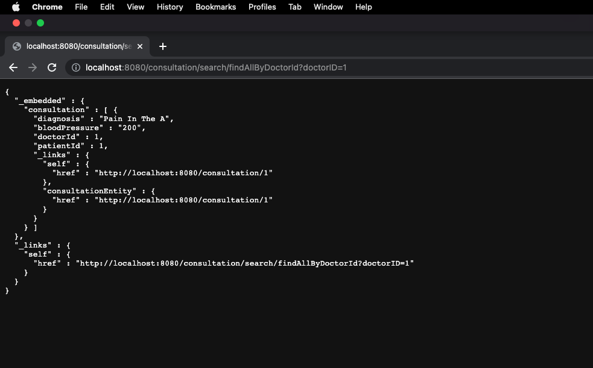

# How to Run

<li>Create an enmpty database in mysql</li>
<li>Update properties in application properties file accordingly</li>
<li>Start Application</li>

### Application will initiate tables and populate tables with test data automatically using FlyWay DB migration scripts.

## Test users

<li> username : doctor | Password : admin</li>
<li> username : patient | Password : admin</li>

# To see Attribute Based Permissions in Actions

<li>Navigate to : <a href="http://localhost:8080/consultation/search/findAllByDoctorId?doctorID=1">http://localhost:8080/consultation/search/findAllByDoctorId?doctorID=1</a> </li>
without logging out
<li>Navigate to : <a href="http://localhost:8080/consultation/search/findAllByDoctorId?doctorID=3">http://localhost:8080/consultation/search/findAllByDoctorId?doctorID=3</a> </li>

Too lazy to run? 

Look at the screenshots here.

## When accessing own consultations

## When accessing others consultations

 